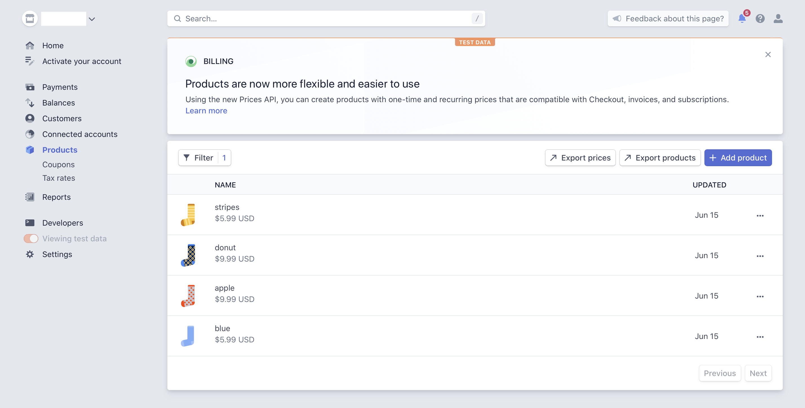
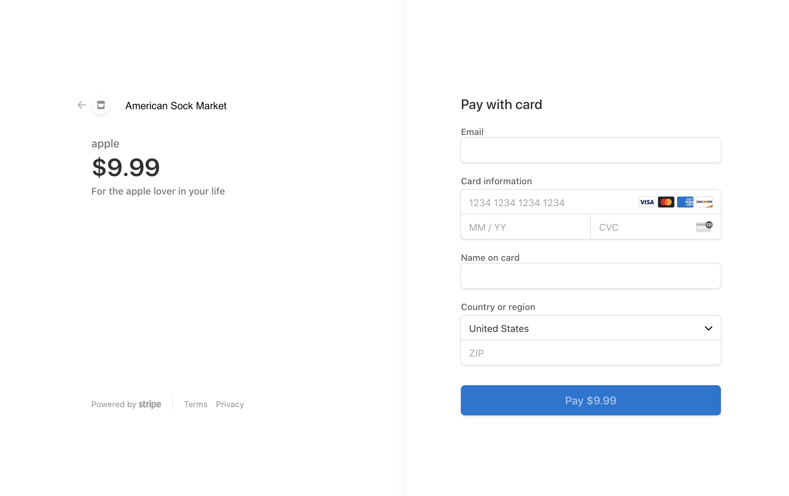

# Part 1 - Set up shop! 

In this part you will learn how to use the Stripe Dashboard to create a basic product inventory. In our example we will use a fictional illustration studio that wants to license digital copies of their illustrations online.

By using [Stripe Checkout](https://stripe.com/docs/payments/checkout/client-only), a prebuilt payment page, we can host all the files we need in a GCP Bucket.

## Create products and SKUs 

Stripe lets you create a simple product inventory in the Dashboard. By creating products on Stripe, you remove the need of maintaining a server and database to store information on your inventory and prices.



## Create your product page

A product page should let the customer pick a SKU to purchase, and redirect to Checkout with the SKU (or SKUs!) the customer selected:

```
stripe
.redirectToCheckout({
    items: [{ sku: order.id, quantity: 1 }],
    successUrl: domain + "/completed.html",
    cancelUrl: domain + "/canceled.html"
})
```

Checkout will display a responsive and internationalized checkout page with your product information.



## Set up a webhook to fulfill the order

You can't guarantee that a customer will be redirected to your success page -- there's always a chance they will close the browser session before the redirect happens. 
That's why you need an asynchronous process to complete any business-critical processes, such as sending an email confirmation or starting a shipping process.
Let's learn about that in Part 2! 
